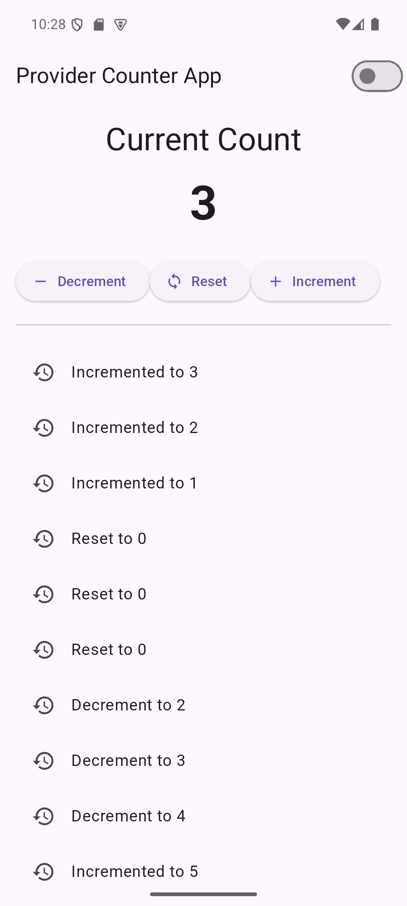
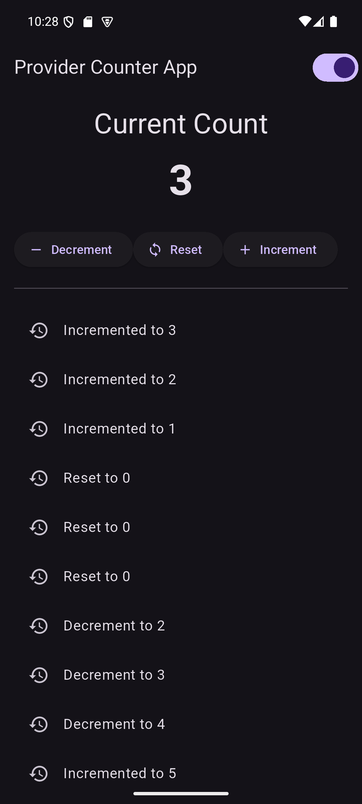

Counter App Built with Provider

Increases or decreases a counter.

Toggles between light and dark themes (with Provider).

Saves every counter change in a history list.

Uses multiple providers (for counter and theme).

